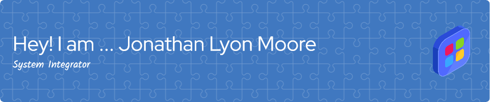



How to Build MS-DOS and the Windows Operating System
				

<a target="_self" href="https://computerhistory.org/blog/microsoft-ms-dos-early-source-code/" data-test-app-aware-link="">MS-DOS Source</a>

MS-DOS 1.25 was published on GitHub MS-DOS 1.25 was completely written in 8086 assembly so it needs to be assembled using an assembler (MASM and SCP 8086 Assembler). The object file(s) produced by MASM will then be linked to produce an executable which will then be converted to a raw binary executable (.COM). The .HEX files produced by SCP 8086 Assembler will be converted directly to raw .COM files using the HEX2BIN utility.

2. How to Make DOS?

This is as hard as the source code for the DOS BIOS (IO.SYS) was designed for Virtual Box and is not PC-compatible. Theoretically, the compiled binaries should work on Virtual Box but using the source code release by Microsoft alone will not produce a valid bootable disk as no source code for the boot sector is given. I do have access to the source code of the boot sector but as a result of Microsoft not releasing it publicly, I will not share it. This basically means with only the source code published by Microsoft, it is impossible to produce a working copy of MS-DOS 1.25.

3. What is Required

The following is required for compiling MS-DOS 1.25:

<ul>
   <li> Microsoft Macro Assembler (MASM)</li>
   <li> Microsoft 8086 Object Linker (LINK)</li>
   <li> EXE to Binary Conversion Utility (EXE2BIN)</li>
   <li> Seattle Computer Products 8086 Assembler (ASM)</li>
   <li> HEX to Binary Conversion Utility (HEX2BIN)</li>
   <li> A copy of the MS-DOS 1.25 source code</li>
</ul>

4. Details

The files STDDOS.ASM and MSDOS.ASM can be assembled to produce the DOS kernel and they are MASM compatible. All switches are set in the file STDDOS.ASM. MSVER generates binaries for MS-DOS with Microsoft copyright strings, IBM produces IBM PC-DOS binaries with IBM copyright strings. There is no need to change HIMEM and DSKTEST unless you want to experiment more with it.

COMMAND.ASM can be assembled using MASM to produce the command interpreter for MS-DOS. Just like the DOS kernel, you may use switches to produce both MS-DOS and IBM PC-DOS binaries. The HIMEM switch is also present.

ASM.ASM, HEX2BIN.ASM, IO.ASM and TRANS.ASM were written by SCP and must be assembled using their own assembler. IO.ASM have switches to configure the floppy disk controller and the Cromemco 4FDC is currently supported by The SIMH Altair 8800 Z80 simulator.

5. Compile It

Now, we are ready to compile MS-DOS 1.25 for the first time! If you are experienced in assembly, used those assemblers and tools listed above, then you should be able to get everything done by yourself. For those unable to assemble it on their own, my build disk will save your time.

Here is how to build MS-DOS 1.25 with the build disk: Download the build disk. Create a new virtual machine using your favorite emulator or hypervisor. Add a floppy drive, load the build disk. Start the virtual machine (it should boot from the build disk). Check the filenames using the DIR command and it should return: Type in MK <FILENAME> to assemble that particular component or MK ALL to assemble everything. Once you have everything assembled, type in DIR *.COM and DIR *.SYS to see the executable produced, it should be similar to: You have done it! You can now copy those executables to another disk or extract them or run them!

<h2>Please Sign the Sphinx Logic CLA<h2>
<ul>
<li><a target="_self" href="https://cla-assistant.io/">cla assistant</a></li>
</ul>

<h2>Biography</h2>

During my time in college I signed a federal master promisary note and was a private student. Growing up with Charles Darwin and Alternitive Music, I studied Donald E. Knuth and Andrew Tanaumanbum. I discoverd the book 'Proving Darwin'. I finished my computer science course work at MITx. I grew up in a strict Elizabethan era household. I live in a Virginia Apartment. In accordence with post WWII art deco. The grocery store in about 5 miles away. I have a problem with feeling a home because of relationship problems in 1999. I'm far from homeless but it feels that way.

I bielive in the UK's old class system. I'm American and UK upper class according to lineage and graduated to Ivy League college with scholar awards in computer science. I'm enrolled in MITx. And I've finished my UVa coursework at MITx and Stanford online. I'm waiting on a offical MIT affiliation because I'm not fond or their partner universities to graduate. I've given $1k to the University of Washington and have access to materials. I was UVa-Wise ACM Vice President am a current IEEE and USENIX member. I'm writing congress to enforce Max Weber thories of police and education polices. I hold a .NET Foundation seat and or Windows seat at the .NET Foundation and pay my dues. I own Windows 10 Enterprise LTSC 2019. I sold my Microsoft and Adobe stock in 2013 and left college after I sent a gift to the Actress Anne Hathaway in 2011. Microsoft's Jonathan Chang called my Wise, Va apartment with my Microsoft MVP Award in 2011. I'm still trying to collect my Code Center Priemium Benifits. I'm a Royal Society of the Arts Fellow. I'm paternal and materal egyptian ashkanazi jewish and is now Anglican because of Charles Darwin a local dissident. As tradition royality keeps it in the family. I'm a Hathaway and Mculley too. I have seven hereidty titles in my family from the UK. <a target="_self" href="https://en.wikipedia.org/wiki/Moore_(surname)">Moore</a>, Vaughn, Turner, Chapman, Little, Lyon, Spensor, Roberts, Bright, Hathaway and McCulley. I have a stutter and got it from a Turner who is relelated to a Windsor. I am Royalty am a Moore related to William the Conquer, a Windor, Lyon and Spensor. The Movie the King's Speech was a real life story of King George the VI and won best picture. Staring Carter and Firth. Pluto and Venus are soulmates if you believe in that. <a target="_self" href="https://www.wired.com/2003/12/genius-2/">The Key to Genius</a> The Ukranie War is over Viking Land and President Putan is a INTJ like me also. I am Windows 7 internals certified. <a target="_self" href="https://www.facebook.com/jonathandavidlyonmoore/photos_albums">My Facebook Photo Albums</a>
 

Worked on Made with Macromedia enhanced Cd's from 1999-2006. I used to work for Macromedia from 1998-2006. In San Fransisco, Ca. Which gave me a nice $8 million dollar patent portfolio and a 2006 Microsoft $28 million dollar tender offer funds. After reading the tender offer. I'm eligible for a book transfer of funds to Microsoft. I've printed my 25 years of career paperwork into one perfect folder. Me and Ms. Hathaway keep in touch to this day. I do not support Virginia V. Loving nor do I support country accents. I never have owned one country music album and was born in Johnson City, TN. and lived in Atlanta, Ga for 10 years. I have fond memories of the Swan House it the historical distric. Me and my family support Bristol TN/Va in the 50's before country music moved in and my father office refects it. I grew up on C.S. Lewis, Jane Austin, and Thomas More, classical music, opera, the ballet and rock n' roll. I grew up with Ninch Inch Nails, Tori Amos, Pearl Jam, Guns N' Roses, Soundgarden and the Smashing Pumpkins. My favorite concert in G N'R Paris 92' Have fond memories of the United Coal Ballet when I was younger. I do not support homosexuality. I'm gay not queer. I do not support the Linux operating system because it is false advertsing and is really just a hack and support Intel MINIX for acedemia and NetBSD for <a target="_self" href="https://en.wikipedia.org/wiki/Interix" data-test-app-aware-link="">Microsoft Intrerix</a>. Windows XP is in support until 2029 in Visual Studio 2019. We will move forward with Windows Vista source and beyond after 2029. I use Redmond, Wa's Living Computer Museum and connect to a XKL Toad-2. I'm working with XKL to buy a TOAD-2 running CTSS for my home like Pual Allen before me.

I've given Tri-Cites TN/Va 23 years to implement the Maslow's Hierarchy of Needs. With my family. I'm waiting on a judgement from from the DOJ. My mother, Tennessee, California, Washington and the nations of the England, Ireland and the Netherlands or Holland has been positive reinforments my mom died when I was 18. My father who did work on my credit, VHCC, UVa-Wise but has been a negitive reiforcement so was my step mom. Maybe it's Virginia that is just a negitive reiforcement. Anne Hathaway the Actress was a positive reinforment. Until she got married in 2012. I don't support her movies anymore. I sold all of my Microsoft and Adobe shares in and am using Azure Arc on Windows Server 2012 R2. I was a Microsoft and Adobe shareholder from 2002-2013. I put a market option call for Microsoft shares to drop below $82.00 in 2026. I don't support physicians in engineering. I do support Mark Russovich and David Solomon And the Windows Internals 4th which featured Jonathan S. and Keith Moore and my 60 Technical Cases at Microsoft. FreeBSD and building UNIX from the bottom up to Mac-like Operating Systems. I really only support UNIX from System V to BSD 4.4. In Contract. I currently own Hewlet Packard, GE, UNISYS, and AT&T shares, also a Fidelity income fund. All of my fame has been self-actualization when I should be told. My diagnoses was a misdiagnoses because a Dr. in Marion, Va used the game theroy trick 'agree to disagree' when I recieved straight A's in college. I own 2 HP desktops a Elite and a Z8. Which is a 2019 model running Windows 2019 Enterprise LTSC. <a href="https://www.hp.com/us-en/workstations/z8.html">HP Z8</a></li>. I only stake my reputation on this tutorial if I ever play the chain store game in game theroy.

I currently have a trust and startup documents and contract with Microsoft. I will have to sell shares of both when my father signs. My computer is a fixed asstet with a added value of $12 billion. Via COCOMO II Models. Which is now reflected in my Merril Lynch Net Worth. I've been a Merril Lynch investor for 15 years. I have the revenue and tax returns for a new home I'm just not buying during the current 2021 administration housing bubble. I do quialify for a jumbo housing loan and have paid my bills ontime for 22 years. I order merchdise online. Since my first order in 1996 at CDNOW.

<h2>Acedemia</h2>
<ul>
<li><a href="https://www.minix3.org/" data-test-app-aware-link="">MINX 3</a></li>
<li><a target="_self" href="https://ocw.oouagoiwoye.edu.ng/about/mirror-site-program/">MIT Open Courseware Mirror Site Program</a></li>
<li><a target="_self" href="https://scholar.google.com/citations?user=aBc-Oc8AAAAJ&hl=en">My Google Scholar</a></li>
<li><a target="_self" href="https://www.goodreads.com/jonathandavidmoore">My Goodreads</a></li>
<li><a target="_self" href="https://www.imdb.com/user/ur154049466/watchlist/">My IMDB</a></li>
</ul>

The following movie arrived in theaters the year I started Sullins Acedemy

<ul>
<li><a target="_self" href="https://www.imdb.com/title/tt0085514/reference/">The Exterminators of the Year 3000</a></li>
<li><a target="_self" href="https://futuretimeline.net/">Future Timeline</a></li> 
<li><a target="_self" href="https://www.theverge.com/2021/6/5/22491859/supreme-court-van-buren-cfaa-hacking-law-scope-narrowed">The Supreme Court pared down a controversial anti-hacking law</a></li>
</ul>

According to Andrew Tanumbuam top down Operating System design is best, bottom up is more practical

<h2>My Visual Studio Extension in the Makrketplace</h2>

<a href="https://marketplace.visualstudio.com/items?itemName=jdm7dv1.JSEnrichments">Javascript Essentials</a></li>

YOU NEED A 600 GIGABYTE VIRTUAL MACHINE TO COMPLETE THIS TUTORIAL

HERE IS WHERE YOU CAN OBTAIN WINDOWS SOURCE CODE FROM THE SHARED SOURCE INITIATIVE <a href="https://www.microsoft.com/en-us/sharedsource/">HERE.</a>

<h2>How to obtain a Enterprise Agreement</h2>
<ul>
<li><a href="https://www.microsoft.com/licensing/docs/view/Products/Software-products">Licencing Documents</a></li>
<li><a href="https://learn.microsoft.com/en-us/azure/cost-management-billing/manage/create-enterprise-subscription?WT.mc_id=facebook">Create a Enterprise Agreement Subscription.</a></li>
<li><a href="https://learn.microsoft.com/en-us/azure/cloud-adoption-framework/ready/landing-zone/design-area/azure-billing-enterprise-agreement">Plan for Enterprise Agreement enrollment</a></li>
<li><a href="https://learn.microsoft.com/en-us/azure/cost-management-billing/manage/ea-direct-portal-get-started">Get started with your Enterprise Agreement billing account</a></li>
<li><a href="https://www.microsoft.com/en-us/sharedsource/enterprise-source-licensing-program.aspx">Enterprise Source Licensing Program</a></li>
<li><a href="https://azure.microsoft.com/en-us/pricing/offers/ms-azr-0111p">Azure in Open</a></li>
<li><a href="https://learn.microsoft.com/en-us/visualstudio/subscriptions/buy-activate-retail">Visual Studio subscriptions are available through the Microsoft Store</a></li>
<li><a href="https://marketplace.visualstudio.com/vs">Extensions for Visual Studio & Subscriptions</a></li>
<li><a href="https://learn.microsoft.com/en-us/partner-center/mpn-get-action-pack">Microsoft Action Pack Subscription (MAPS)</a></li>
<li><a href="https://learn.microsoft.com/en-us/lifecycle/products/windows-10-enterprise-ltsc-2019">Windows 10 Enterprise LTSC 2019</a>
<li>You must own a Enterprise Product to have a Enterprise Agreement with a EULA and at least 5 PC's</li>
</ul>

Microsoft's Open Source Program

<ul>
<li><a href="https://opensource.microsoft.com/program/">Open Source Program</a></li>
<li><a href="https://learn.microsoft.com/en-us/openspecs/dev_center/ms-devcentlp/13571077-e344-4e6f-a477-369894979798">Patent Promises and Patents</a></li>
</ul>

Adobe Contibutor Licence Agreement

<ul>
<li><a href="https://opensource.adobe.com/cla.html">Adobe Open Source</a></li>
</ul>

Microsoft Legal

<ul>
<li><a href="https://learn.microsoft.com/en-us/entra/identity/saas-apps/convercent-tutorial">Tutorial: Microsoft Entra integration with Convercent</a></li>
</ul>

Liquity Value

<ul>
<li><a href="https://www.lawinsider.com/dictionary/liquidity-value">Liquidity Value definition</a></li>
<li><a href="https://www.investopedia.com/terms/n/noi.asp">Net Operating Income For Real Estate</a></li>
</ul>

Microsoft has one mailing list for the Microsoft Research introductory project 'Detours'

I have my System Integrator ID and NDA which you can find in the Partner Center. You can access Microsoft Collaborate <a href="https://developer.microsoft.com/en-us/windows/support/?tabs=Contact-us">here</a> I'm retired from Microsoft until the faternity leaves and Computer Science teaches Opertaing System Theory again. Or until Microsoft is a Computer Science Company not a IT Company.

 You may want to try DR-DOS 7.03 from 
<a target="_self" href="https://en.wikipedia.org/wiki/Santa_Cruz_Operation" data-test-app-aware-link="">Caldera</a> Licensing or
<a target="_self" href="https://en.wikipedia.org/wiki/Novell" data-test-app-aware-link="">Novell</a> DR-DOS 7.0 from 1999 a updated from MS-DOS as the operating system stayed up to date until 2011 at Novell. and fetch the latest Perl distribution from the NT Sources Perl distribution and start DOS Globbing. I'm working on a Alpha, VAX or MIPS server and I hope I can boot something from the 

<ul>
<li><a target="_self" href="https://www.psychologytoday.com/us/blog/biocentrism/201112/does-the-soul-exist-evidence-says-yes" data-test-app-aware-link="">Does the Soul Exist? Evidence Says ‘Yes’</a></li> 
<li><a target="_self" href="https://en.wikipedia.org/wiki/DECUS" data-test-app-aware-link="">DECUS</a></li>
<li><a target="_self" href="https://www.itprotoday.com/compute-engines/mipsnt-allied-birth" data-test-app-aware-link="">MIPS/NT allied at birth</a></li> 
<li><a target="_self" href="https://www.itprotoday.com/compute-engines/windows-nt-and-vms-rest-story" data-test-app-aware-link="">Windows NT and VMS: The Rest of the Story</a></li>
<li><a target="_self" href="https://www.computerworld.com/article/1727355/sco-confirms-microsoft-has-licensed-its-unix-technology.html" data-test-app-aware-link="">SCO confirms Microsoft has licensed its Unix technology</a></li>
<li><a target="_self" href="https://news.microsoft.com/2006/11/02/microsoft-and-novell-announce-broad-collaboration-on-windows-and-linux-interoperability-and-support/" data-test-app-aware-link="">Microsoft and Novell Announce Broad Collaboration on Windows and Linux Interoperability and Support</a></li>
<li><a target="_self" href="https://learn.microsoft.com/en-us/visualstudio/releases/2019/compatibility" data-test-app-aware-link="">Visual Studio 2019 Compatibility</a></li>
<li><a target="_self" href="https://devblogs.microsoft.com/oldnewthing/20180122-00/?p=97855" data-test-app-aware-link="">The history of change-packing tools at Microsoft (so far)</a></li>
<li><a target="_self" href="https://devblogs.microsoft.com/oldnewthing/20181224-00/?p=100545" data-test-app-aware-link="">Random internal Windows terminology: IDW, Razzle, and their forgotten partners IDS and Dazzle</a></li>
<li><a target="_self" href="https://cybersecurity.att.com/blogs/security-essentials/its-only-a-hacker-if-its-linus-himself" data-test-app-aware-link="">It's Only A Hacker If It's Linus Himself</a></li>
<li><a target="_self" href="https://www.zdnet.com/article/minix-intels-hidden-in-chip-operating-system/" data-test-app-aware-link="">MINIX: ​Intel's hidden in-chip operating system</a></li>
</ul>

Cache the Hewlett Packard operating environment for OpenVMS from the <a href="https://ftp.zx.net.nz/pub/archive/">ftp.zx.net.nz World-Wide Web Server</a> FTP Server and start updating to x86. Start with the 95 Win32 SDK. Find the MAPI Sample. Install Azure DevOps which comes with the <a href="https://learn.microsoft.com/en-us/azure/education-hub/access-education-hub">Education Hub on Azure</a>. For Computer Science Majors or Alumni. With the default collection and a OS project. Named OS the path should be _git/OS

In Cygwin use:

<pre>wget -r --no-parent to cache a directory</pre>
<ul>
<li>Single UNIX Specification, and put <a href="https://en.wikipedia.org/wiki/UNIX_System_V">AT&T System V</a> and <a href="https://archive.org/details/ATTUNIXSystemVRelease4Version2">Source</a> in SFU or SUA and <a href="https://kb.iu.edu/d/agjx">Ultrix</a>, <a href="https://www.tuhs.org/">Source</a> in DEC.</li>
<li>The <a href="https://ecma-international.org/publications-and-standards/standards/ecma-335/">ECMA 335</a> 336 Standard started in 2002 and 2006 and worked on FreeBSD before Linux The .NET Framework work begain in 1998 with the COM SDK and the Next Generation Web Services SDK.</li> 
<li><a href="./docs/index.html">Here</a> is the documentation for it. The archive can be found on <a href="https://github.com/SSCLI">Github</a></li> 
<li><a href="powerpoints/AdvancedComputerScience-TeachingwiththeSSCLI.ppt">Advanced Computer Science Teaching with the SSCLI</a> is a SSCLI Powerpoint.</li>
<li><a href="https://www.amazon.com/Common-Language-Infrastructure-Annotated-Standard/dp/0321154932">The Common Language Infrastructure Annotated Standard</a></li>
<li>The .NET Framework 3.5 is in support until 2029.
</li>
<li><a href="https://learn.microsoft.com/en-us/dotnet/standard/choosing-core-framework-server">.NET vs. .NET Framework for server apps</a></li>
</ul>
<pre>Launch a CMD prompt and type pwd to execute UNIX Commands in the Win32 shell. With SFU or SUA.</pre>
<ul>
<li>Aslo cache the University of Washington and Digital Corp from the same server. You should have your freeware 8.0 for XP from the HP FTP cache. Become a USENIX Member and download all the Login Jounals and put it in your HP's paper's directory.</li>
<li>You can start updtaing the XP HP cache to x86 32-bit for Services for UNIX in XP/2003. 64-bit for SUA and Windows Server 2003 R2. I started with my Oracle Contract and netbeans 8.1 source and apache ant 1.7 from apache. I might have Visual Studio Webcasts or courses from my 2000, 2004 and 2008 MSDN Enterprise Subscriptions.</li> 
<li>You can buy Visual Studio Source from <a href="https://codejock.com/">Code Jock Suite Pro</a> a Microsoft Partner at Component Source. You also may want to install Bridgeworks from the HP Cache on XP to help port <a href="https://www.amazon.com/Microsoft-Interoperability-Toolkit-Developer-Reference/dp/0735619220">J2EE to .NET Framework</a> from OpenVMS.</li>
<li>Intsall GitFVFS from  <a href="https://github.com/microsoft/VFSForGit">GitHub</a> to speed up the cloning and pushing of repositories.</li>
<li>You can read about the Windows Repo here: <a href="https://vfsforgit.org/">VFS for Git: Git at Enterprise Scale</a></li>
<li><a href="https://learn.microsoft.com/en-us/lifecycle/products/windows-10-enterprise-and-education">Windows 10 Enterprise and Education</a> You may want <a href="https://learn.microsoft.com/en-us/lifecycle/products/windows-10-enterprise-ltsc-2019">10 2019 LTSC</a> like me so you'll have until 2029.</li>
<li>Install Cygwin, the minimium Delev category and the latest <a href="https://www.oracle.com/java/technologies/downloads/">JDK from Oracle.</a></li>
<li>Clone the Java JDK from Github and install at least the Visual Studio 2019 Build Tools. All Devops projects should be in the _git/OS directory.</li>
<li>The future GIT structure can be found in the 2005 or 2008 MSDN Library Samples.</li>
<li><a href="https://devclass.com/2023/05/25/azure-linux-released-at-build-where-microsoft-revealed-why-it-did-not-fork-fedora/">Azure Linux released at Build where Microsoft revealed why it did not fork Fedora</a></li></ul>

<h2>Internal Developer Server or Workstation for Windows NT 3.5.</h2>

Install on Windows 3.5 Advanced Server, Windows NT 4.0, Back Office Suite or 2003 in a Virtual Machine.

<pre>Download the Win32SDK Extract the MDX Microsoft Access 97 file with 7-Zip or open it with Microsoft Access. 
I use Microsoft Access 97.</pre>

<pre>Install the Windows NT 3.5 DDK. setupddk.bat C:\ddk mips, alpha or i386.</pre>

<pre>Install the Windows NT 3.5 SDK. setupsdk.bat C:\</pre>

<pre>Copy the SDK, DDK, MSTOOLS, and MSDEV directory's to the build drive.</pre>

<pre>run razzle.cmd</pre> 

<pre>set the _NTDRIVE and the apporiate paths</pre>

<pre>D:\NT-782\NT\private\bldtools\buildall.cmd B1</pre>

If you want to build a IDW release execute the following

<pre>D:\NT-782\NT\private\bldtools\idwrelease.cmd built;nonbuilt</pre>

<h2>Internal Developer Server or Workstation for Windows NT 4.0</h2>

Install on Windows NT 4.0, Back Office Suite or 2003 in a Virtual Machine.

<pre>Install the Windows NT 4.0 DDK. You may have to look for a IDW DDK RC Release.</pre>

<pre>Install the Windows NT 4.0 SDK.</pre>

<pre>Install Visual C++ 4.0 w/ MFC Migration Kit.,</pre>

<pre>Copy the DDK, MSTOOLS, and MSDEV directory's to the build drive.</pre>

<pre>Use the CAB SDK to make a cabinet file of the Leaked ZIP to make a CD+R of the Cabinet. 
If you are using NT 4.0 use expand.exe to extract the NT source to its location.</pre> 

<pre>Extract the NT.CAB or cabinet file containing full Windows NT 4.0 source in it.</pre>

<pre>Place the NT Root in the root SDK Directory.</pre>

<pre>Install the Windows NT 4.0 DDK.</pre>

<pre>Install the Windows NT 4.0 SDK.</pre>

<pre>Install Visual C++ 4.0 w/ MFC MIgration Kit.</pre>

<pre>Copy the MSDEV, DDK, And PlatformSDK directory's to the Build drive and rename the DDK to 'IDWNT4' </pre>

<pre>set Path=D:\NT40\MSDEV\bin;D:\NT40\IDWNT4\bin;%path%</pre>

<pre>set Lib=D:\NT40\MSDEV\lib;D:\NT40\MSTOOLS\lib;%lib%</pre>

<pre>set Include=D:\NT40\MSDEV\include;D:\NT40\NT\public\sdk\inc;D:\NT40\NT\private\inc;%include%</pre>

<pre>cd D:\NT40\MSTOOLS\</pre>

<pre>edit VCVARS32 to set MSDevDir=D:\NT40\MSDEV set vcsource=D:\NT40\MSDEV</pre>
									
<pre>run SETENV D:\NT40\MSTOOLS D:\NT40\MSDEV\BIN</pre>

<pre>cd D:\NT40\IDWNT4\bin</pre>

<pre>run D:\NT40\IDWNT4\bin\setenv.bat D:\NT40\IDWNT4</pre>

<pre>build -cz to build the DDK</pre>

<pre>run razzle.cmd with the 'main' 'hotfix_checked' or 'hotfix_free' argument</pre> 

<pre>In razzle set the _NTDRIVE and the apporiate paths</pre>

<pre>You can build just a section of NT using B1, B2 or B3 on the command line.
B1 builds from NT\Private.  B2 builds SDKTools and Utils.B3 builds
Setup, Posix, MVDM, WinDbg, and OS2. </pre>

<pre>D:\NT40\NT\private\bldtools\buildall.cmd B1</pre>

<h2>Internal Developer Server or Workstation for Windows 2000.</h2>

<pre>As of this writing 2000 Source is only 33%.</pre>
<pre>I dont play Black Ops Cold War I'm just not that kind of person.</pre>

<h3>Whistler and pre-reset Longhorn</h3>

 The top-most branch was called <strong>main</strong>, which integrated changes from all labs. Under it were several numbered labs, each of which was working on a separate part of Windows, such as:

</ul>

 These labs also had a "_N" branch, which served as a buffer between main and the actual branch. For example, changes from the main branch would first get integrated into Lab06_N before later being   integrated into Lab06 in a process called forward integration. The same   applied for reverse integration, where the lab would first integrate   changes into its N-branch before integrating them into the main branch.

 There were also <strong>idx</strong> (internal development workstation/server) branches, builds from which are usually recompilations intended for TAP/OEM partners. However, they were also   occasionally released for public testing, e.g. <a target="_self" href="https://betawiki.net/wiki/Windows_Longhorn_build_4074" data-test-app-aware-link="">Windows Longhorn build 4074</a> or <a target="_self" href="https://betawiki.net/wiki/Windows_XP_build_2257" data-test-app-aware-link="">Windows XP build 2257</a>. 

 Before the release of <a target="_self" href="https://betawiki.net/wiki/Windows_XP" data-test-app-aware-link="">Windows XP</a>, the main branch was forked into the <strong>xpclient</strong> branch while the main branch moved on to track <a target="_self" href="https://betawiki.net/wiki/Windows_Server_2003" data-test-app-aware-link="">Windows Server 2003</a> development.After the final version was shipped, new branches were created for   updates, hotfixes and Service Pack development. Similarly, the <strong>dnsrv</strong> branch   (short for Dot NET Server, i.e. Windows .NET Server) was forked from   the main branch before the release of Windows Server 2003. 

<h3>Since Longhorn reset </h3>

The lab hierarchy was overhauled after the development reset of <a target="_self" href="https://betawiki.net/wiki/Windows_Vista" data-test-app-aware-link="">Longhorn</a> to   address the flaws that plagued most of the pre-reset period. Instead of  having a small amount of general virtual build labs each focusing on a  different general scope of Windows functionality, a new hierarchical   model with considerably more feature branches was introduced, which   helped reduce the amount of code to reverse integrate for branch.   Microsoft also set stricter criteria for reverse integrating changes   from the labs into the main branch, which was now renamed to <strong>winmain</strong>. 

 The main branch was later renamed to <strong>rsmain</strong> at some point after the release of <a target="_self" href="https://betawiki.net/wiki/Windows_10" data-test-app-aware-link="">Windows 10</a>, and then to <strong>rsmaster</strong> after   the Windows source repository's conversion to Git, likely to comply with the Git convention of calling the top-most branch the master   branch. At some point after February 2021,
<a target="_self" href="https://betawiki.net/wiki/Build_lab#cite_note-5" data-test-app-aware-link="">[2]</a> the branch was renamed back to <strong>main</strong>. This was likely done in order to follow suit with other Microsoft   projects after the master/slave terminology became a subject of controversy in 2020 due to slavery connotations.
<a target="_self" href="https://betawiki.net/wiki/Build_lab#cite_note-6" data-test-app-aware-link="">[3]</a>
<a target="_self" href="https://betawiki.net/wiki/Build_lab#cite_note-7" data-test-app-aware-link="">[4]</a>

 Historically, the build lab was a physical room populated with machines that periodically produced mainline builds of <a target="_self" href="https://betawiki.net/wiki/Windows_NT" data-test-app-aware-link="">Windows NT</a>. At first, there was a single build lab for the entire project that all   developers submitted their changes to. As the number of developers grew, the concept of virtual build labs was introduced, where each team   developing a subset of the feature set works on its own separate branch   and has one or more machines compiling periodic builds of that branch. Each developer submits their changes first to their team's branch, and   they are merged to the mainline only after they meet its acceptance criteria. Other teams can then pull the changes from the mainline into their branches. 

 Builds that were not built by the build lab machines, but are rather compiled by individual Microsoft employees, are called private builds. They are identified by having the VS_FF_PRIVATEBUILD file flag set in the executable's version information and by including the account name of the individual or service that initiated the build in the   branch part of the build tag. 

 Microsoft has used several branching systems since the start of <a target="_self" href="https://betawiki.net/wiki/Windows_XP" data-test-app-aware-link="">Windows XP</a> development, which differ in the hierarchy of labs as well as in the naming scheme. However, there are some specifics common to most schemes, such as the presence of a top-most main branch, or the use of special branches for important development milestones. 

<h2>Internal Developer Server or Workstation for Windows Server 2003</h2>

<a target="_self" href="https://web.archive.org/web/20110527022943/http://www.microsoft.com/resources/sharedsource/windowsacademic/default.mspx">Microsoft Acedemic Program</a>

The Official Build Number of the XP/2003 source is 5.1.2600.6000 is revision 6000 the same as the XP Embedded RTM. 

Make a Windows 2000 Advanced Server or Server 2003 or 2003 R2 Virtual Machine with SFU for 2003 and SUA for 2003 R2.
Your UNIX source should go in SFU or SUA usr->src directory AT&T System V or SCO V5 or V6 is fine.

 If you need to use 'expand /r' to X:\ENGLISH\WIN2003\ENT\I386\* D:\binaries.x86fre from a retail DVD. 

 1. Set the Signing Certificate

<pre>buildnum.exe in sdktools you may have to build it, to get the machine name and build number of the operating system.</pre>
<pre>certmgr -add D:\NT\tools\testpca.cer -r localMachine -s ca</pre>
<pre>cd D:\NT</pre>
<pre>tools\checktestroot.cmd and tools\checktestpca.cmd </pre>

2. Setting Razzle

<pre>tools\razzle free offline or tools\razzle win64 amd64 free offline    

or for checked     

tools\razzle offline or tools\razzle win64 amd64 offline </pre>

<pre>Make a PROJECT_ROOT and a private directory and make one NT project tools\ntnewver.cmd is 
incomplete to complete in production in the NT directory use the Windows Research Kernel in college 
ask the Computer Science Dept. System Administrator. For access.</pre>
<pre>and a sdktools and make the apporoite directories into a private directory. 
Bring in the sdk and ddk sources into your private directory if you want and start with the 'Begin' project 
Any maybe the VS directory in the sdktools debuggers directory and make a new enlistment or NT Project. 
Next use the source depot templates to set up source depot.</pre>

<pre>Rename 'projects.map' in the tools directory to 'sd.map' and place in the root of the NT directory.</pre>

<pre>3. Build or find xcopy and findstr from the RTM DVD and place on path</pre>

 4. Setting the Path:

<pre>path %path%;D:\NT\tools\perl\bin;D:\binaries.x86fre;D:\NT\tools\sp;D:\NT\tools\x86</pre>
<pre>set sdxroot=D:\NT</pre>
<pre>enlist projects ex: sdx enlist NT master com -c 
tools\ntnewver.cmd</pre>
<pre>\\PATSTYLESVS.main.x86.fre</pre>
<pre>\\%COMPUTERNAME%.main.x86.fre in BuildMachine.txt</pre>    

We look in BuildMachines.txt for the machine name, branch, architecture,and build type. If we find a match, then we set OFFICIAL_BUILD_MACHINE
 to the appropriate value ("primary" or "secondary") look for the the offical build machine client in sdktools->debuggers->vs->enlistment->sd.ini.txt.

<pre>tools\verifybuildmachine.cmd</pre>
<pre>perl xcopy2binplace.pl</pre>

You can compile the Lab 01 down to about 8 errors the rest of the Labs and Operating System shouldn't have any errors. You should have the research kernel to muck around with also from college, 
needing to comment out the Longhorn additions in revision 6000, files beginning with 'dp' are Longhorn files. The 'dp' files are not in the 'Longhorn' beta LDK they maybe in a IDW or internal developer workstation release if I can find one. 
Maybe look in Embedded 2009 for supported hardware and maybe learning what PCI hardware and coding the plug n' play to support in the NT Kernel. 
The PCI codes you can use now a days in 2024 is Linux and you might want to remove some of the cheap hardware.

<strong>Lab01</strong>: Kernel
<pre>Copy the base\ntos directory and all of it's files to Lab01 it might be a virtual lab 
in source depot and it is a physical lab.</pre>
<pre>CD to base\busdrv\isapnp and use the message compiler to generate 'message.h'</pre>
<pre>Make pcicodes.h using the message compiler too. This file goes in base\busdrv\pci</pre>
<pre>build -cz </pre> 
<pre>delobj.cmd to clean the source tree</pre>	

<strong>Lab02</strong>: Networking
<pre>Copy the NT\net directory to Lab02. The Network Stack or Lab will build without error in the Vitrual Lab. 
 You might have issues in the Pysical Lab</pre>		
<pre>build -cz</pre>
<pre>delobj.cmd to clean the source tree</pre>

<strong>Lab03</strong>: Server<a target="_self" href="https://betawiki.net/wiki/Build_lab#cite_note-3" data-test-app-aware-link="">[c]</a>
<pre>Copy the Entire Server folder from nt5src.7z to Lab03</pre>
<pre>The entire Server build should build with about 20 shipping errors and take about 6 hrs for a free build and 12 hrs for a checked.</pre>
<pre>build -cz</pre>
<pre>delobj.cmd to clean the source tree</pre>

<strong>Lab04</strong>: Terminal Services<a target="_self" href="https://betawiki.net/wiki/Build_lab#cite_note-4" data-test-app-aware-link="">[1]</a>
<pre>Copy NT\termsrv directory to Lab04. The Terminal Services Stack should build without error in the Virtual Lab.
You might have issues in the Physical Lab.
</pre>
<pre>build -cz</pre>
<pre>delobj.cmd to clean the source tree</pre>

<strong>Lab05</strong>: Shared Source Common Language infustructure
<pre>However the Beta Wiki doesn't list a Lab 05 I believe it's either the SSCLI or the COM Stack. 
With the .NET Framework. To build the SSCLI you need Visual Studio 2005 Professional 
or higher in a 2000 or 2003 Virtual Machine. 
Active State Perl ActivePerl-5.16.3.1603-MSWin32-x86-296746.msi ActivePerl-5.16.3.1603-MSWin32-x64-296746.msi</pre> 

<pre>ActivePerl-5.16.3.1603-MSWin32-x64-296746.msi for 64-Bit extract the sscli20_20060311.tgz 
for 2.0 or 1.0 sscli_20021101.tgz sscli_ref_20021101.tgz and and Gyro Genetrics with 1.0 
and execute env.bat at the root of the directory. To set the free or checked 
environment then execute buildall.cmd To build the COM stack run build -cz 
in the root of the COM directory or lab.</pre>

<strong>Lab06</strong>: User interface
<pre>Copy NT\shell directory to Lab06. The UI Stack should build without error in the Virtual Lab.
 You might have issues in the Physical Lab. With the GNUmakfile
</pre>
<pre>build -cz</pre>
<pre>delobj.cmd to clean the source tree</pre>

<strong>Lab07</strong>: Internet Information Services/COM+ 
<pre>Copy NT\inetsrv directory to Lab07. The IIS Stack should build without error in the Virtual Lab.
You might have issues in the Physical Lab.
build -cz</pre>
delobj.cmd to clean the source tree</pre>

 build individual projects 

<pre>in the directory of a makefile with build -cz</pre>

 or 

 build the whole operating system 

<pre>perl tools\timebuild.pl -NOCLEANBUILD -NOSYNC -NOSCORCH </pre>
If you want to wait 6 to 12 hours for a new clean build you'll type this:
<pre>perl tools\timebuild.pl -!NOCLEANBUILD -NOSYNC -NOSCORCH  -NOPOSTBUILD</pre>
<pre>build -cz</pre>

make a 'symbol' share with symbol and build subdirectories.

<pre>symsrv.cmd</pre>

 POSTBUILD: 

 We only create boot floppy images on fre compressed i386 builds. 

<pre>tools\postbuildscripts\sanitycheckunicodefiles.cmd</pre>

 Generate the winnt32.msi for different SKUs 

<pre>tools\postbuildscripts\winnt32msi.cmd</pre>
<pre>tools\postbuildscripts\makebuildname.cmd</pre>
<pre>tools\postbuildscripts\cdimage.cmd -d Release</pre>
<pre>move delobj.cmd the the tools directory to the NT Root and clean the source tree by deleting all the object files. After the build</pre>

Close Razzle Window run the VC7 vcvars32.bat from the VCBuilt share and set _NTTREE environment variable. Which is the binaries directory.

<pre>path %path%;D:\binaries.x86fre\bldtools</pre>

Copy the 'copyddkfiles.cmd' the the NT\base\ddk directory for the tools directory run: 

<pre>copyddkfiles.cmd ddk_base.ini ddk D:\NT\base</pre>

It should begin to copy the ddk files you will need to edit the ddk, hal, IFS INI files to fit your kit needs. 

You might want to learn how to make a service pack.

<pre>cd to D:\NT\tools\postbuildscripts\svcpack\ and open spcab.cmd and set the FILELIST CABNAME and EVENTNAME using the gold directory
text files as a FILENAME</pre>

After the build run the post build batch file in the tools directory and read the error log you shouldn't get any errors in Windows XP/2003 Professional Edition. 

<pre>certmgr.msc, go to Trusted Root Certification Authorities\Certificates and remove the Microsoft Test Root Authority certificate,
Sign out and Sign in again. The 'For Testing Purposes' Watermark should now be removed.</pre>

It takes 6 hours to build a Free Build and 12 hrs a Checked.

Themes

<pre>To test the defualt Visual Styles build and execute UXBUD.EXE in the shell->themes directory</pre>

Build packthem, cd to the themedir and build 'mallard' read the Powerpoints use Office XP, And Adobe CS2.

<a href="https://archive.org/details/winxp-mallard">Here's is a Mallard Screenshot</a>

After the build the Active Directory Migration Tools and Debugging Tools should be built. After the post build very edition and every supported language should be built. In the binaries directory the usa   default build should be revision 6000 leading up to Windows Embedded 2009. After the Windows 6000 revision source build you might want to use the SLD files in the 'mantis' folder with XP embedded and make a Embedded Windows repository and engineer 2003 revision 6000 which was released in Embedded 2009. You can compile the Operating System down to about 16 errors needing to remove the Longhorn additions in revision 6000 maybe look in Embedded 2009 for supported hardware and maybe learning what PCI hardware and coding the plug n' play to support in the NT Kernel. The PCI codes you can use now a days in 2024 is Linux and you might want to remove some of the cheap hardware.

<h2> Building a XP/2003 Embedded Runtime Image </h2>

Use the Target Analyzer probes to create a comprehensive list of all hardware devices installed on the device. You can choose from either of the Target Analyzer probes, Ta.exe or Tap.exe. Ta.exe is a real-mode 16-bit application that can be run using Microsoft MS-DOS. Tap.exe is a protected Microsoft Win32-based application that runs on Microsoft Windows XP or Microsoft Windows 2000 Service Pack (SP) 2 OS that supports Plug and Play. Tap.exe produces a more complete and refined hardware list than Ta.exe.

The following list shows the hardware requirements for the Microsoft Windows Preinstallation Environment that is included on the Windows XP Embedded CD 1. 

A computer that can boot from an El Torito CD. 
A Pentium, preferably Pentium II or later, CPU. 
128 MB RAM. It is possible that 64 MB will work but it may cause a low memory error if networking is initialized. 
A display adapter that supports VESA mode video. 
After you have booted the device, run either Target Analyzer probe program, based on your needs. The Target Analyzer probe creates a file that contains the Plug and Play identifiers for each device installed on the target device. The default name for the .pmq file is Devices.pmq. Copy the device list to your development system

You create a configuration using one of the following two methods: 

Using the Target Designer import function. 
Using Target Designer to manually create a configuration. 
To import the device list 

To create a configuration based on the device list, run Target Designer. 
The device list is imported as a configuration into the configuration editor. 

1. From the File menu, choose Import. 
2. In the Choose File for Import dialog box, type the name of the device list, or browse to search for the file. 
3. Choose Import. 

There are four ways to add a component to a configuration in Target Designer: 

From the Configuration menu, choose Add Component. 
Drag the component from the component browser, and then drop it into the configuration editor. 
Right-click the component, and then choose Add. 
Choose the component in the component browser, and then choose Add on the toolbar. 

A dependency is a functional relationship between two or more components. Before building your configuration into a run-time image, you should run a dependency check to ensure that all the component dependencies have been resolved. 

To check your dependencies, choose the Configuration menu in Target Designer, and then choose Check Dependencies.

If the dependency check encounters components with unresolved dependencies, a task describing the requirement is automatically added to the Tasks list for each unresolved dependency.

You can locate a resolution by opening a task. The database shows only the component or components that can resolve the task. You simply select the check box for a component, and then choose OK.

For example, the following task may appear in the Tasks list:

COM Base [Version 1.0, R1] is dependent upon at least one of component 'RPCSS [Version 1.0, R4]'.

For this example, you would open the task. The task becomes a filter that searches the database for all components that contain the name RPCSS [Version 1.0, R4]. The Resolve Dependency dialog box then displays only the components containing RPCSS in the name.

Continue resolving tasks, closing each task as it is resolved. When all tasks have been resolved, run the dependency check again, because a new component added as a resolution may have other dependencies. Ensure that all dependencies are resolved.

The build process uses the information in a configuration to construct a complete run-time image. 

To build the run-time image 

1. From the Configuration menu in Target Designer, choose Build Target Image. 
2. In the Build type box, select Release. 
Note   Select Release even during development and when you are debugging an application. Select Debug if you are performing a low-level OS debug, such as debugging a device driver.
3. In the Destination box, type the full path where you want to store the new run-time image. 
4. In the Log file box, type the full path and file name for the log file. 
5. Choose Build.

After you have built your run-time image, you need to prepare your device for image deployment.

The BootPrep tool prepares your device for booting a Windows embedded system. The device must have an active partition that has been formatted and made bootable with a FAT16, FAT 16, or FAT32. The BootPrep tool replaces the partition boot sector code that would typically boot into MS-DOS by loading Io.sys and Msdos.sys with the code that loads the Windows NT loader, called NTLDR. 

Note  NTFS file systems are not supported by this utility. If you wish to use NTFS file system, you must create your initial file system using one of the FAT file systems and then use the Convert tool provided with Windows XP to convert your file system to the NTFS file system.

After you have prepared your device for deployment, you are ready to deploy the run-time image from your development system to your device. 

You can transfer the image using traditional methods such as disk, or bootable CD-ROM. You can also swap a storage device such as a hard disk drive or persistent storage module, such as ROM or flash memory or disk. You can also transfer the image electronically over a communications line. 

You can use the deployment tools to transfer, install, and configure the run-time image to your device. 

To create an ISO image of the Pre-FBA run-time image
Open a command prompt window. For example, from the Start menu, choose Run. In the Run Window, type: cmd 

Change to the Windows Embedded\utilities directory. For example: 
 
<pre>cd "\Program Files\Windows Embedded\utilities"</pre>  

Run the hd2iso utility. 

Select 1. Create an ISO-9660/El Torito bootable image file. The ISO image menu appears. 

Select 2. Select physical drive. The Select physical drive menu appears. 

Select the deployment hard disk. For example, select PhysicalDrive1. 

Select 3. Select partition(s). The Set partition(s) menu appears. 

Select the 650 MB FAT16 partition where the run-time image is located. For example, select Partition 1. Return to the Main menu by typing P. 

Select 4. Set image File path. The Image file path menu appears. 

Type the full path of where the ISO image file should be created. For example, C:\PreFBA.iso 

Select 5. Advanced Options. 

Choose 5. Select partition to boot. Select the first bootable partition. Return to the menu by typing P. 

Select 6. Create image. The hd2iso utility creates an ISO image based on the contents of the selected partition. 

After you have created the ISO image, create a CD-ROM from the ISO image by using CD creation software that supports ISO images. The CD-ROM that you create is the Pre-FBA run-time image CD-ROM. 

After you create your CD-ROM, you are ready to boot your run-time image and run the FBA process.

To run FBA, enable EWF, and run ETPrep on your run-time image
Copy the run-time image to the deployment hard disk. For example, use Windows Explorer, select the run-time image files in the Windows Embedded Images directory and drag and drop them to the deployment hard disk. 

Shut down your system and remove the power cable. 

Remove the development hard disk from the system. 

Attach the deployment disk to the primary IDE channel as master. 

Attach the CD-ROM drive to the secondary IDE channel as master. 

Reattach the power cable and power on the system. Insert the Pre-FBA CD-ROM into the CD-ROM drive. 

Configure your BIOS to boot from the hard disk. 

Boot your run-time image from the deployment hard disk and allow the FBA phase to finish. 

During the FBA phase, the system will reboot twice. 

To verify that EWF is configured, open a command prompt and run EWF manager. For example, type the following at a command prompt: 

<pre>ewfmgr</pre>

The following sample output is displayed.
  
Ewf Volume Configuration
Volume Size            64512
Segments               0
Segment Size           20
Free segments          0
Max Levels             1
Max Protected Volumes  1
Protected Volumes      1
Overlay volume percent full 0.00
Protected volumes
Arc Path "\Device\HarddiskVolume1" [C:] 

Verify that EWF is configured to protect the C: drive by typing the following command: 
  
<pre>ewfmgr c:</pre>  

The following sample output is displayed: 

Protected Volume Configuration
Type            RAM
State           DISABLED
Boot Command    NO_CMD
  Param1        0
  Param2        0
Persistent Data ""
Volume ID       D2 02 96 49 00 0E 59 96 02 00 00 00 00 00 00 00
Device Name     "\Device\HarddiskVolume1" [C:]
Max Levels      1
Clump Size      512
Current Level   1
Disk space used for data 0 bytes
Disk space used for mapping 0 bytes
Memory used for mapping 0 bytes 

If EWF is reporting errors, verify that EWF is configured properly by opening the C:\Windows\FBA\FBALOG.txt file. For more information, see Troubleshooting Enhanced Write Filter. 

After you have verified that EWF is properly configured, use the etprep /all command from a command line. This command will delete the EWF volume and configure the run-time image to boot from the CD-ROM drive. For example: 
 
<pre>etprep /all</pre>  

The system will immediately reboot. Do not reboot your post-FBA run-time image. Shut down the system and remove the power cable. 

Reattach the Windows Embedded Studio development disk to the system as a master disk on the primary IDE channel. 

Reattach the deployment disk to the system as the target disk on the primary IDE channel. 

Reattach the power cable and configure the BIOS to boot from the hard disk. 

Remove the Pre-FBA CD-ROM from the CD-ROM drive. 

Boot the development hard disk. 

After your run-time image is properly configured, you are ready to burn it to a bootable CD-ROM.

To create an ISO image of the post-FBA run-time image
Open a command line. 

Navigate to the Windows Embedded\utilities directory. For example, by typing the following command: 

cd "\Program Files\Windows Embedded\utilities" 

Run the hd2iso utility by typing: 

<pre>hd2iso</pre> 

Select 1. Create an ISO-9660/El Torito bootable image file. The ISO image menu appears. 

Select 2. Select physical drive. The Set physical drive menu appears. 

Select the deployment hard disk. For example, select PhysicalDrive1. 

Select 3. Select partition(s). The Set partition(s) menu appears. 

Select the 650 MB FAT16 partition where the run-time image is located. For example, select Partition 1. Return to the Main menu by typing P. 

Select 4. Image File path. The Image file path menu appears. 

Type the full path of where the ISO image file should be created. For example, C:\PostFBA.iso. 

Select 6. Create image. The hd2iso utility creates an ISO image based on the contents of the selected partition. 

After create the ISO image, you must create a CD-ROM from the ISO image by using CD creation software that supports ISO images. Simply copying the ISO image to the CD-ROM will not enable it to boot. You should use a third-party CD-ROM burning utility to create a CD-ROM from the ISO image. 

The CD-ROM that you create is the Post-FBA run-time image CD-ROM. 

Note:  
The CD-ROM may appear empty if it is viewed in Windows Explorer. This is because the contents of the bootable CD-ROM are written in a low-level language that Windows Explorer does not recognize.  

Your post-FBA CD-ROM is your bootable CD-ROM. You can immediately deploy this CD-ROM on your system.
 
If the target directory is not empty, Target Designer prompts you to confirm the deletion of the directory.

<h2>Windows Vista and Beyond</h2>

In a free build the kernel may not build you may have to to use the Windows Research Kernel. Microsoft does not give you the source to WinLogon even in the SSLIP. It's named Winlogon.exe.lc

A <strong>build lab</strong> (or simply a <strong>lab</strong>) commonly refers to a <a target="_self" href="https://betawiki.net/wiki/Microsoft_Windows" data-test-app-aware-link="">Microsoft Windows</a> source code branch. By extension, it can also refer to the team that works on this branch. 

 Microsoft has used multiple prefixes to refer to feature branches over time:
  

<a href="https://learn.microsoft.com/en-us/windows-hardware/drivers/debugger/microsoft-public-symbols">Setting up a Public Symbol Server</a>
<pre>You can use the Symchk tool to check to see if the Symbol file is public or private.</pre>
<h3> Release branch prefixes </h3>
<pre>Mono is acedemic .NET Framework</pre>
<a href="https://www.mono-project.com/docs/compiling-mono/windows/">Here are the Windows Build Instructions.</a>

 Similarly to the previous system, the main branch is forked off before release to contain update development. The following is the list of known prefixes:

You might want to install the Longhorn Driver Kit or LDK and SDK the Samples from the SDK or in the PDC 2003 Whideby DVD and the SDK Help. Here is a link to the <a href="https://archive.org/details/pdc-2003-conference-dvds-presentation-and-longhorn-discs">2003 PDC</a>and <a href="https://archive.org/details/vsenard1">PDC 2003 Whideby DVD</a>

In the LDK Samples you might want to start a GIT Repo in the OS directory. Per kind of the Offical Windows Repo here:<a href="https://github.com/microsoft/microsoft-ui-xaml/releases?page=9">Microsoft.UI.Xaml v2.1.190405004.2</a>in the Windows Porting Directory and here: You need a login.

<pre>git clone https://microsoft.visualstudio.com/os/_git/os </pre>

On Windows 10 you might was to install Scalar

<a href="https://vfsforgit.org/">VFS for Git: Git at Enterprise Scale</a>
<pre>Download the Windows API Code Pack extract it.</pre>
<a href="https://sphinxlogic-my.sharepoint.com/:f:/g/personal/jonathanmoore_sphinxlogic_onmicrosoft_com/Eveh4s4tiyNKgN3C4JiP1HABPzMgjMH0R59f0OSkvDJszQ?e=ZNuu2Q">Download it from my Sharepoint drive</a>

You can read about the Windows API Code Pack from the Code Project <a target="_self" href="https://www.codeproject.com/Articles/109403/Windows-API-Code-Pack-v-Released" data-test-app-aware-link="">here</a>

<pre>Please refactor with Visual Studio 2017, 2019 on 10 or 2005 in the XP VM,
the namespace 'Microsoft.WindowsAPICodePack' to 'Microsoft.Windows'</pre>
<pre>Set up a Lab03_N a buffer lab with a "N' NOT A FINAL LAB. with the 7 IDW SDK, IDW DDK, .NET Framework 3.5 Reference Source, 
Symbols and Classic Samples. And it wont be a Final lab until we get more source from the KGB in Russia.</pre> 
<pre>Or Install the 2008 SDK and WDK copy the 6.1 and sdk files to a Lab03_n and take note the the 7 samples directory is really your 'NT' 
directory</pre>
<pre>and compare both sdk and wdk with directories with windiff and carefully go through the samples and src directories and 
compare and recreate Lab03 save both setenv.bat files and name the apporiate files setenv.sdk and setenv.ddk.</pre>
<pre>After your done and you set the ddk environment. You can set up the VS Directory with SharpDevelop,  
The Common Compiler Infustructure, Dafney, .NET Framework 3.0 Reference Source,Symbols Windows API Code Pack, 
The Visual Studio Project System and Spec#.</pre>
<pre>Set up a Lab03_N with the Longhorn LDK, SDK, Longhorn Samples, and the MSDN Library Samples. and Classic Samples.
Use Visual Studio 2008 	MSDN Library Samples to begin a 'Source' Layout. 
For Future Git Version Control. Join USEINIX,and the ACM and try and 
find Vista Microsoft Research Papers.</pre>

Acedemia Papers

<a href="https://www.sciencedirect.com/science/article/pii/S1742287607000503">Here is a VAD Tree acedemic paper</a>

<ul>
<li><strong>fbl</strong> (feature branch level) - <a target="_self" href="http://www.windowswiki.info/2010/05/18/a-little-story-about-feature-build-labs/">A little story about feature build labs</a>
 <li><strong>vista</strong>, <strong>longhorn</strong>, <strong>lh</strong> - <a target="_self" href="https://betawiki.net/wiki/Windows_Vista" data-test-app-aware-link="">Windows Vista</a>, <a target="_self" href="https://betawiki.net/wiki/Windows_Server_2008" data-test-app-aware-link="">Windows Server 2008</a></li>
<li>Longhorn requires .NET Framework 1.2 found the redistributable found in the PDC 2003 Discs. Which can be found on the internet archive.</li>
<li><a target="_self" href="https://www.youtube.com/watch?v=7e3v4N0WXVg">The Best Operating System Microsoft Never Released (Longhorn Overview)</a></li>
<li>You might want to start with the Login Screen demo in the Longhorn SDK Samples.</li>
<li><strong>win7</strong> - <a target="_self" href="https://betawiki.net/wiki/Windows_7" data-test-app-aware-link="">Windows 7</a>, <a target="_self" href="https://betawiki.net/wiki/Windows_Server_2008_R2" data-test-app-aware-link="">Windows Server 2008 R2</a></li>	
<li><strong>win8</strong> - <a target="_self" href="https://betawiki.net/wiki/Windows_8" data-test-app-aware-link="">Windows 8</a>, <a target="_self" href="https://betawiki.net/wiki/Windows_Server_2012" data-test-app-aware-link="">Windows Server 2012</a></li>
<li><strong>winblue</strong> - <a target="_self" href="https://betawiki.net/wiki/Windows_8.1" data-test-app-aware-link="">Windows 8.1</a>, <a target="_self" href="https://betawiki.net/wiki/Windows_Server_2012_R2" data-test-app-aware-link="">Windows Server 2012 R2</a></li>
<a href="https://learn.microsoft.com/en-us/windows-hardware/drivers/develop/installing-the-wdk-build-environment-in-a-lab">Installing the WDK 8.1 Build Environment in a Lab</a>

</ul>

<pre>I know there were alot of Windows 10 versions but the only dev version that is complete is version 10.0.18362.1</pre>
<ul>
<li><strong>19h1</strong> - <a target="_self" href="https://betawiki.net/wiki/Windows_10_May_2019_Update" data-test-app-aware-link="">Windows 10 May 2019 Update</a>, <a target="_self" href="https://betawiki.net/wiki/Windows_10_November_2019_Update" data-test-app-aware-link="">Windows 10 November 2019 Update</a></li>
<li><strong>fe</strong> (<a target="_self" href="https://betawiki.net/wiki/Iron" data-test-app-aware-link="">Iron</a>) - <a target="_self" href="https://betawiki.net/wiki/Windows_Server_2022" data-test-app-aware-link="">Windows Server 2022</a></li>
</ul>

<pre>Download you Windows Server 2022 SDK & WDK Supscription Only</pre> 
<pre>download the latest perl sources by running lwp-download.bat it he tools/perl directory and build perl.</pre>

The future of this paper with cover Windows NT 3.5, NT 4,0 and 2000 with some UNIX Ports.

<a href="https://www.hp.com/us-en/workstations/z8.html">After all your hard work hope you enjoy this HP Z8 Workstation</a>
